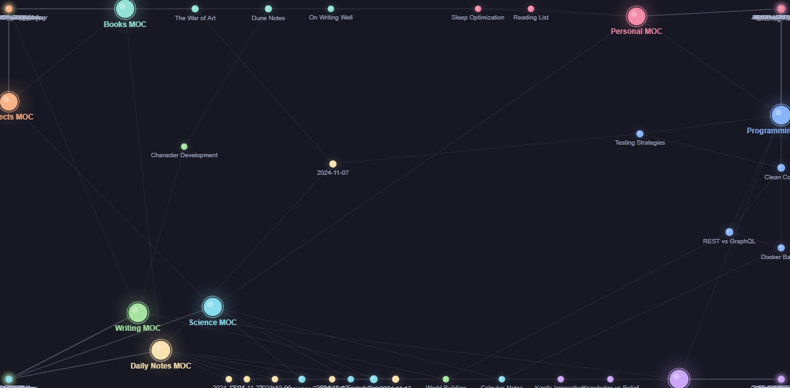

# Vault Dashboard - Interactive Obsidian Knowledge Graph Plugin

**Live Demo:** [https://outblade.github.io/obsidian-vault-dashboard/demo.html](https://outblade.github.io/obsidian-vault-dashboard/demo.html)



An Obsidian plugin that turns every new tab into a live analytics dashboard. Visualize your entire knowledge base as an interactive force-directed graph, track writing progress with real-time stats, explore your most-used tags, and navigate recently modified notes — all without leaving Obsidian.

**Keywords:** Obsidian plugin, knowledge graph, vault dashboard, note-taking analytics, force-directed graph, Obsidian stats, knowledge base visualization, PKM dashboard, second brain, Obsidian MOC

## Features

- **Interactive Knowledge Graph**: Force-directed graph with topic clustering — notes in the same folder attract each other into visible clusters
- **Live Vault Stats**: Real-time note count, estimated word count, total links, and unique tag count
- **Tag Cloud**: All tags scaled and weighted by frequency across your vault
- **Recently Modified**: The 10 most recently touched notes with relative timestamps and one-click navigation
- **Drag and Zoom**: Drag nodes to reposition, scroll to zoom, pan freely across the graph
- **Hub Detection**: MOC and highly-connected notes are automatically larger and ringed
- **Topic Filtering**: Click any legend entry to dim or hide an entire topic cluster
- **Node Tooltips**: Hover any node to see note name, topic, connection count, tags, and word count
- **Open Notes Directly**: Double-click any node to open that note in Obsidian
- **Auto-Refresh**: All panels update automatically as you create, delete, or rename notes
- **Configurable**: Adjust max graph nodes and label visibility from plugin settings

## Live Demo

**Try the browser simulation now:** [Vault Dashboard Live Demo](https://outblade.github.io/obsidian-vault-dashboard/demo.html)

**What you can do:**

- Explore an 88-note synthetic vault across 8 topic clusters
- Drag nodes and watch the physics simulation react
- Scroll to zoom in on dense clusters and read node labels
- Click legend entries to isolate or hide topics
- Double-click any node to inspect its metadata
- Hit "Simulate Writing" to watch notes get added in real time

## Technology Stack

- **Frontend:** TypeScript, HTML5 Canvas API, CSS3
- **Physics Engine:** Custom force-directed simulation (repulsion + spring + clustering forces)
- **Obsidian API:** MetadataCache, Vault events, ItemView, Plugin settings
- **Build Tools:** esbuild, Node.js, npm
- **Deployment:** GitHub Pages (browser demo)

## Installation

### Prerequisites

- [Obsidian](https://obsidian.md/) (>= 0.15.0)
- [Node.js](https://nodejs.org/) (>= 16.0) — for building from source
- [npm](https://www.npmjs.com/)

### Quick Start

```bash
# Clone the repository
git clone https://github.com/OutBlade/obsidian-vault-dashboard.git
cd obsidian-vault-dashboard

# Install dependencies
npm install

# Build the plugin
npm run build
```

Copy the three output files into your vault's plugin folder:

```bash
cp main.js manifest.json styles.css "<YourVault>/.obsidian/plugins/vault-dashboard/"
```

Then in Obsidian: **Settings → Community plugins → enable Vault Dashboard**

A grid icon appears in the ribbon. You can also open it via the command palette: `Open Vault Dashboard`.

### Development Mode

```bash
# Watch for changes and rebuild automatically
npm run dev
```

## Usage

### Opening the Dashboard

```typescript
// The plugin registers a ribbon icon and a command
// Ribbon: click the grid icon in the left sidebar
// Command palette: "Open Vault Dashboard"

// The view opens as a new tab and stays in sync with your vault
```

### Interacting with the Graph

```typescript
// Drag a node to reposition it — physics resumes on release
// Scroll wheel to zoom in/out
// Click and drag the background to pan
// Double-click a node to open that note in Obsidian
// Hover a node for a metadata tooltip
// Click a legend color to dim/hide that topic cluster
```

### Plugin Settings

```typescript
// Settings → Community plugins → Vault Dashboard → Options

const settings = {
  maxNodes: 150,      // Top-N notes by link count shown in graph
  showLabels: true,   // Toggle note name labels on the graph
};
```

### Advanced Graph Configuration

```typescript
// The force simulation uses three forces:
// 1. Repulsion — all node pairs push apart (prevents overlap)
// 2. Spring edges — linked notes attract each other
// 3. Clustering — same-topic notes softly attract each other

// Hub notes (MOCs, high-degree nodes) are automatically detected:
// radius = 9 + min(degree, 12) * 0.5
// Regular notes: radius = 4 + min(degree, 12) * 0.55
```

## Project Structure

```
obsidian-vault-dashboard/
├── src/
│   └── main.ts           # Full plugin source (view, simulation, settings)
├── demo.html             # Standalone browser demo — no build required
├── styles.css            # Plugin stylesheet (uses Obsidian CSS variables)
├── manifest.json         # Obsidian plugin manifest
├── package.json          # npm dependencies and build scripts
├── tsconfig.json         # TypeScript configuration
├── esbuild.config.mjs    # esbuild bundler configuration
├── screenshot.png        # Dashboard preview
└── README.md             # This file
```

## SEO Keywords

This Obsidian plugin is optimized for searches related to:

- Obsidian knowledge graph plugin
- Obsidian vault dashboard
- PKM visualization tool
- Second brain analytics
- Obsidian note statistics
- Force-directed knowledge map
- Obsidian MOC visualization
- Personal knowledge management dashboard

| Metric | Value |
|--------|-------|
| Lines of Code | ~600 (plugin) + ~500 (demo) |
| Obsidian Min Version | 0.15.0 |
| Dependencies | 0 (runtime) |
| Last Updated | 2026-04-10 |

## Roadmap

- [ ] **Phase 1**: Folder-based automatic topic coloring
- [ ] **Phase 2**: Graph timeline — animate how the vault grew over time
- [ ] **Phase 3**: Writing streaks and daily word count chart
- [ ] **Phase 4**: Orphan note detection and link suggestions
- [ ] **Phase 5**: Export graph as SVG/PNG

## Contributing

Contributions are welcome! Here's how to get started:

1. Fork the repository
2. Create a feature branch (`git checkout -b feature/your-improvement`)
3. Commit your changes (`git commit -m 'Add your improvement'`)
4. Push to the branch (`git push origin feature/your-improvement`)
5. Open a Pull Request

### Development Setup

```bash
# Clone and set up
git clone https://github.com/OutBlade/obsidian-vault-dashboard.git
cd obsidian-vault-dashboard
npm install

# Start watch mode
npm run dev

# Copy output to your test vault
cp main.js manifest.json styles.css "<TestVault>/.obsidian/plugins/vault-dashboard/"
```

### Code Style

- TypeScript strict null checks enabled
- Obsidian API types for all vault/workspace interactions
- Canvas rendering isolated in a single `draw()` method
- Force simulation in a pure function with no side effects

## Related Projects

- [Obsidian](https://obsidian.md/) - The note-taking app this plugin is built for
- [Obsidian Graph View](https://help.obsidian.md/Plugins/Graph+view) - Obsidian's built-in graph
- [D3.js](https://d3js.org/) - Inspiration for the force simulation approach
- [Dataview](https://github.com/blacksmithgu/obsidian-dataview) - Popular Obsidian data plugin

## Acknowledgments

- [Obsidian](https://obsidian.md/) for the excellent plugin API and documentation
- [D3.js](https://d3js.org/) for force simulation concepts and inspiration
- [Catppuccin](https://github.com/catppuccin/catppuccin) for the color palette used in the demo
- The Obsidian community for plugin development patterns and best practices

## License

This project is licensed under the MIT License — see the [LICENSE](LICENSE) file for details.

## Links

- **Live Demo:** [https://outblade.github.io/obsidian-vault-dashboard/demo.html](https://outblade.github.io/obsidian-vault-dashboard/demo.html)
- **GitHub Repository:** [https://github.com/OutBlade/obsidian-vault-dashboard](https://github.com/OutBlade/obsidian-vault-dashboard)
- **Obsidian Plugin Docs:** [https://docs.obsidian.md/Plugins/Getting+started/Build+a+plugin](https://docs.obsidian.md/Plugins/Getting+started/Build+a+plugin)
- **Report Issues:** [https://github.com/OutBlade/obsidian-vault-dashboard/issues](https://github.com/OutBlade/obsidian-vault-dashboard/issues)

---

Made with passion by [OutBlade](https://github.com/OutBlade)

**Tags:** Obsidian plugin, knowledge graph, vault dashboard, PKM, note-taking, force-directed graph, second brain, Obsidian analytics
